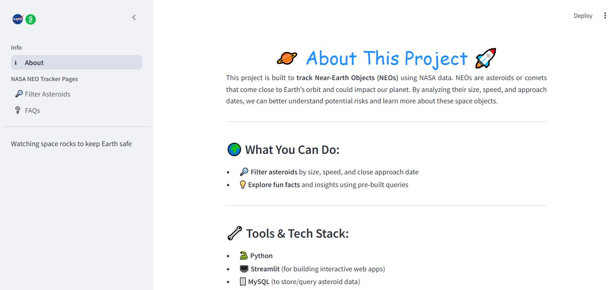
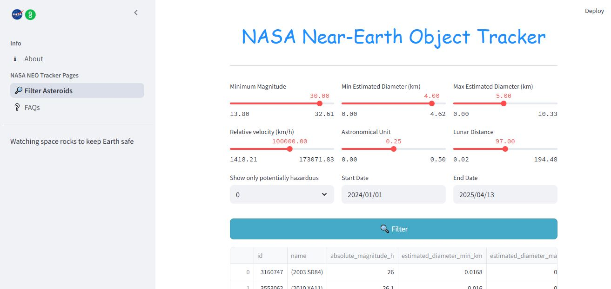
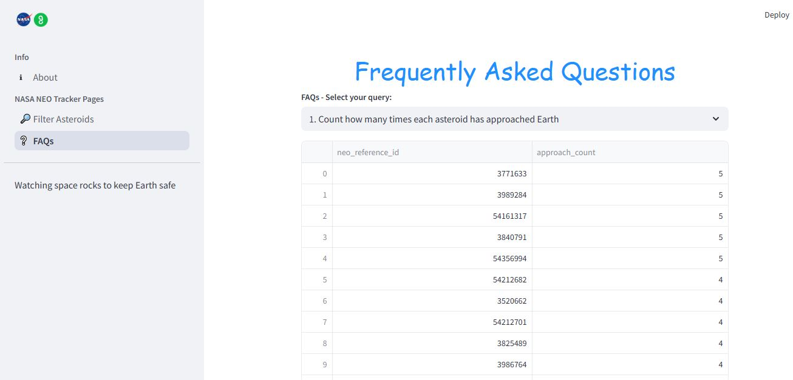

# 🌌 NASA Near-Earth Object (NEO) Tracker

An interactive web application built with **Streamlit** to **track, filter, and analyze Near-Earth Objects (NEOs)** using real-time and historical data from **NASA’s API**, stored in a MySQL database. This project helps visualize potential asteroid threats and enhances awareness of space object activities near Earth.

---

## 🚀 Features

### 🛰️ Core Functionality
- **Interactive Filtering**: Filter asteroids by:
  - Magnitude
  - Estimated diameter
  - Velocity
  - Astronomical Unit (AU)
  - Lunar Distance (LD)
  - Close approach dates
  - Hazard level

- **Pre-built Insights (FAQs)**:
  - Top 10 fastest asteroids
  - Hazardous asteroids with multiple Earth approaches
  - Approaches within 1 Lunar Distance
  - Monthly approach frequency
  - Brightest and largest asteroids
  - Closest approach records and more!

---

## 📷 App UI Preview

| Page | Description |
|------|-------------|
| **About** | Overview of the project and tech stack |
| **Filter Asteroids** | Filter asteroids based on various parameters |
| **FAQs** | Run 25 predefined queries to gain deeper insights |

---

## 🛠️ Tech Stack

| Tool        | Purpose                                 |
|-------------|-----------------------------------------|
| **Python**  | Backend logic and data processing       |
| **Streamlit** | Interactive web app development       |
| **MySQL**   | Asteroid data storage and querying      |
| **PyMySQL** | Python-MySQL database connector         |
| **Pandas**  | Data manipulation and display           |
| **HTML/CSS**| Styling UI elements within Streamlit    |

## 🖼️ App Screenshots

### 🔍 About Page

### 🛠️ Filter Asteroids

### 📊 FAQs and Queries

